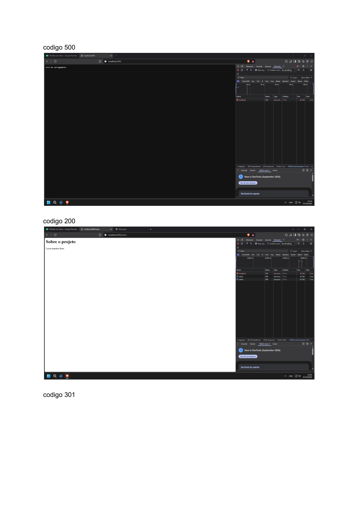
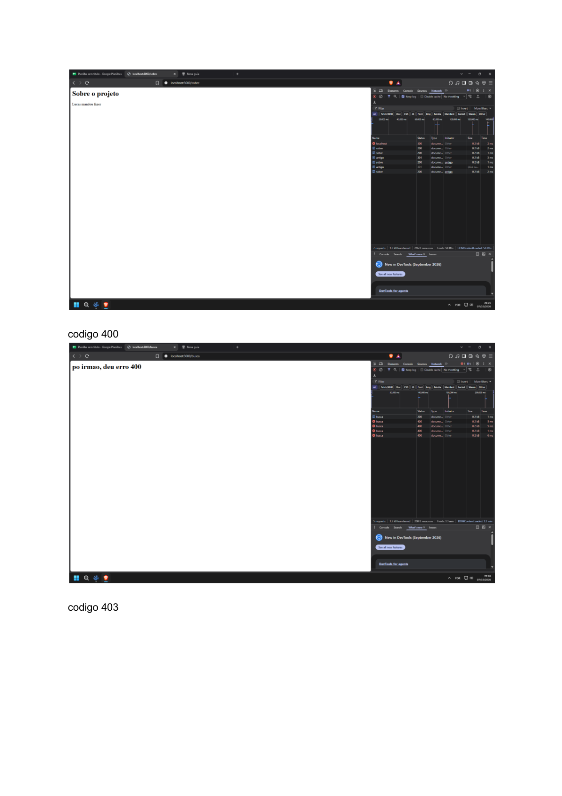
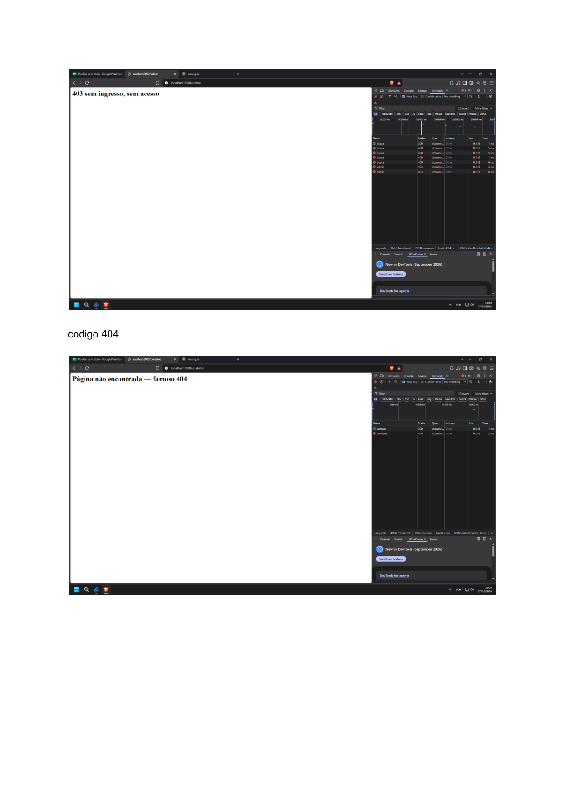

# ADO 1 Protocolo HTTP: requisição, resposta, métodos, status e cabeçalhos

Matéria: Linguagem de Servidor

Eduardo Silva Costa

Este doc foi criado para entender como funciona o protocolo HTTP na prática. Para isso, desenvolvi um servidor com Node.js, como solicitado pelo Lucas Correa

O servidor possui diferentes rotas, cada uma mostrando como funcionam as requisições, respostas, códigos de status e cabeçalhos HTTP.

## O que é HTTP

O HTTP é um protocolo que permite a comunicação entre o navegador e o servidor.

Podemos comparar isso com um restaurante: o cliente faz o pedido, o garçom leva até a cozinha e depois traz a resposta.

Quando digitamos um site, o navegador utiliza o DNS para descobrir o endereço IP do servidor. Depois, estabelece uma conexão, envia a requisição HTTP e recebe a resposta. Por fim, o navegador interpreta o conteúdo e mostra a página.

## Requisição e resposta

Uma requisição possui uma linha inicial, cabeçalhos e, quando necessário, um corpo.

Exemplo de requisição para /sobre:

```http
GET /sobre HTTP/1.1
Host: localhost:3000
Accept: text/html
```

A resposta também possui uma linha inicial, cabeçalhos e pode ter um corpo.

Exemplo simplificado da resposta:

```http
HTTP/1.1 200 OK
Content-Type: text/html; charset=utf-8

<h1>Sobre o projeto</h1>
```

O código 200 significa que o pedido foi atendido.

Esses exemplos devem ser conferidos com as mensagens reais do servidor.

## Métodos HTTP

OS MÉTODOS INDICAM O QUE QUEREMOS FAZER NO SERVIDOR

| MÉTODO | FUNÇÃO | ANALOGIA COM RESTAURANTE |
| --- | --- | --- |
| GET | Consultar dados | Ver o cardápio |
| POST | Enviar dados ou criar algo | Fazer um pedido |
| PUT | Substituir um recurso | Trocar o pedido inteiro |
| PATCH | Alterar parte de um recurso | Retirar um ingrediente |

Um método seguro serve para consultar informações sem solicitar alterações, como o GET.

Um método importante produz o mesmo efeito no servidor mesmo quando repetimos a requisição. GET, PUT e DELETE são exemplos. POST normalmente não é, e PATCH depende da operação.

## Códigos de status

Os códigos informam o resultado do pedido.

PRINCIPAIS CÓDIGOS

| CÓDIGO | SIGNIFICADO |
| --- | --- |
| 200 | Pedido atendido |
| 201 | Recurso criado |
| 301 | Mudou de endereço permanentemente |
| 302 | Mudou de endereço temporariamente |
| 304 | Conteúdo em cache ainda está atualizado |
| 400 | Requisição inválida |
| 401 | Falta autenticação válida |
| 403 | Acesso proibido |
| 404 | Página não encontrada |
| 405 | Método não permitido |

401 e 403: o 401 indica que é necessário se autenticar corretamente. Já o 403 significa que o acesso foi recusado.

301 e 302: o 301 indica uma mudança permanente de endereço, enquanto o 302 indica uma mudança temporária.

## Cabeçalhos HTTP

Os cabeçalhos passam informações extras sobre os pedidos e respostas. São como as observações que fazemos ao pedir comida.

| CABEÇALHO | FUNÇÃO |
| --- | --- |
| Content-Type | Tipo do conteúdo enviado |
| Content-Length | Tamanho do conteúdo em bytes |
| Location | Endereço para redirecionamento |
| Allow | Métodos permitidos |
| Cache-Control | Regras de armazenamento em cache |
| User-Agent | Identifica o programa que fez o pedido |
| Accept | Formatos aceitos pelo cliente |

Stateless e HTTPS

Stateless: o HTTP não lembra dos pedidos anteriores. É como um garçom que atende você, mas depois esquece o que pediu. Para guardar essas informações, os sites usam cookies, sessões ou tokens.

HTTP e HTTPS: os dois servem para trocar informações entre o navegador e o servidor. A diferença é que o HTTPS protege esses dados com criptografia, deixando a comunicação mais segura.

## Servidor desenvolvido

O servidor foi construído utilizando Node.js e os módulos nativos http

ROTAS

| ROTA | STATUS | REAÇÃO |
| --- | --- | --- |
| / | 200 | Página inicial |
| /sobre | 200 | Informações do projeto |
| /antigo | 301 | Redireciona para /sobre |
| /search | 400 | Informa que falta o termo |
| /admin | 403 | Acesso negado |
| /contato | 200 | Página de contato via GET |
| /contato com POST | 405 | Método não permitido, Allow: GET |
| Rota inexistente | 404 | Página não encontrada |

## Evidências

Os testes foram feitos pelo DevTools e pelo terminal, utilizando curl.

### AS PRINTS SEGUEM EM ANEXO NO ARQUIVO .ZIP







FONTES

conhecimento adquirido sobre o http e https:

https://www.youtube.com/watch?v=e-Y_i7FsThA

https://www.youtube.com/watch?v=ZGwAHaFfJ2c

https://www.instagram.com/p/Dd_Zdj8FnnV/?img_index=1

https://www.youtube.com/shorts/QADs28SPE_A

https://www.youtube.com/watch?v=ZF2nj5uYZhc

DECLARAÇÃO DE IA

Conforme fui escrevendo o código, pedi ajuda à IA em alguns momentos, principalmente quando apareciam erros que eu não conseguia identificar ou entender. Por isso, alguns prompts acabam se repetindo. Assim, antes de utilizar a IA, deixei claro que ela deveria apenas explicar o erro e indicar o trecho do código com problema, sem fazer correções, a menos que eu pedisse.

Aqui estão alguns dos prompts utilizados:

- arrume meu projeto o bash esta dando erro ao iniciar o servidor
- Corrigi os erros que impediam o servidor de iniciar:
- Corrigi a pasta rotues para routes.
- Removi a chamada duplicada de servidor.listen().
- arrume dnv
- Corrigido novamente. O problema era um bloco comentado da nova rota /antigo, que deixou as chaves do if/else desorganizadas e causou
- como simulo o código 400
- Para simular o código HTTP 400 Bad Request, você pode retornar 400 quando a rota /busca não receber o parâmetro q.

A ADO foi realizada entre os dias 04/10 e 08/10, aos poucos, seguindo cada etapa disponibilizada no Notion. Utilizei a IA para fazer os commits conforme avançava nas etapas. Só no dia 07/10, às 23h, no auge do cansaço e da preguiça, percebi que a entrega da ADO deveria ser feita obrigatoriamente pelo repositório.

Então, no dia 08/10, às 11h, pedi para a IA organizar os 5 commits conforme solicitado no documento do Notion. Segue o prompt utilizado:

preciso que de commit 5 commit com esses requisito chore: cria projeto node com es modules

feat: cria servidor http e rota inicial

feat: adiciona redirecionamento 301 na rota antigo

feat: valida parametro termo na rota busca com status 400

feat: restringe metodo da rota contato com status 405
